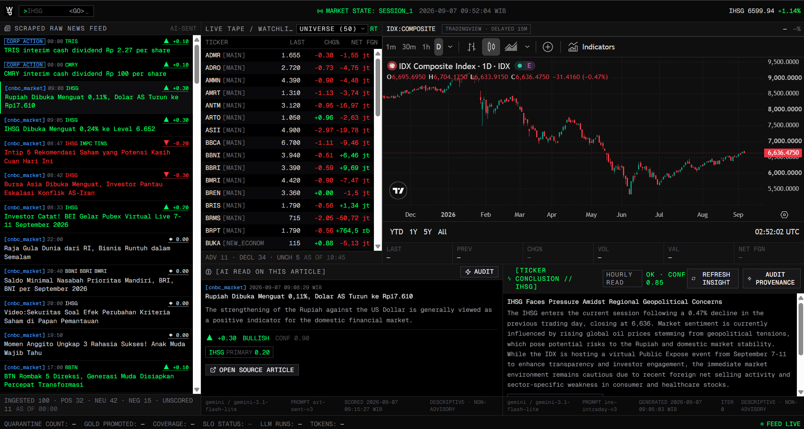
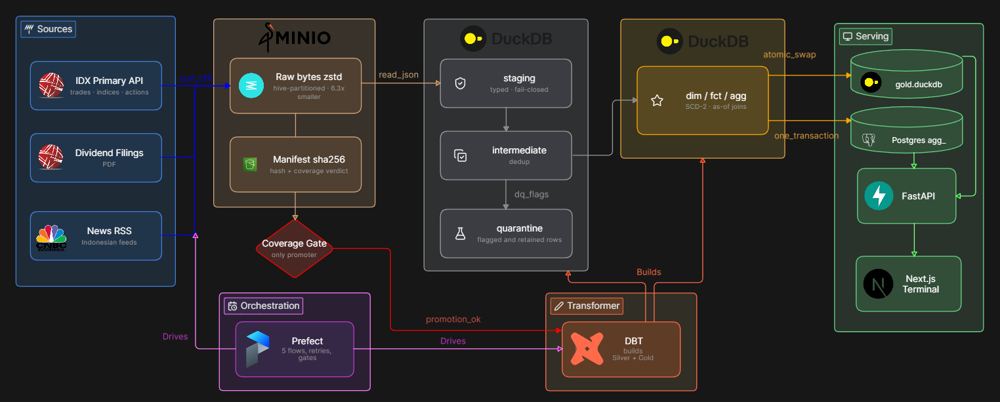
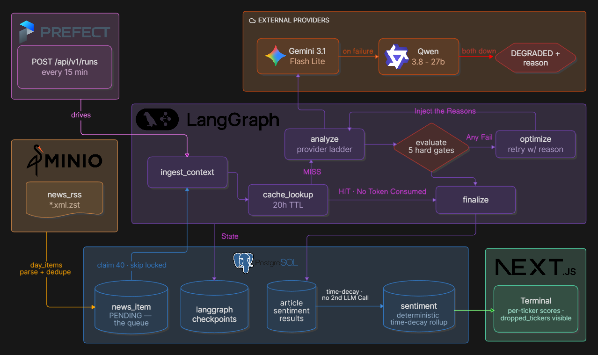

# Gloomberg Terminal

**A Bloomberg Terminal for the Indonesia Stock Exchange. Bloomberg charges around $30,000 a year per seat. This one's free, ...it's just not as good :)**

        

---

## What it is

A production data lakehouse and LLM analysis platform for the Indonesia Stock Exchange. It ingests exchange data and Indonesian financial news into a medallion warehouse, scores every article for market sentiment through an agentic pipeline that refuses to guess, and serves the result to a live terminal.

It is read-only and non-advisory by design. It never places an order and never emits a buy, sell, or price target.

---

## The data engineering side

Eight feeds land as raw bytes in MinIO. dbt builds 43 models through Silver into Gold on DuckDB, and a coverage gate decides whether any of it publishes at all.

Prefect drives five flows: the EOD close at 17:00 WIB, a 15-minute news poller during market hours, an hourly insight pass, an hourly resweep for feeds blocked earlier in the day, and a nightly backfill.

---

## The AI Inference

The model proposes and deterministic code disposes. Every response is parsed into a Pydantic schema, then judged by five hard gates. There is no LLM judge anywhere in the loop. A failure spends one iteration and retries with the reason injected as a correction, capped at three loops and 60,000 tokens.

| Gate | Checks | Catches |
|---|---|---|
| `schema_valid` | the response parses into the Pydantic model | malformed JSON, missing fields, a score outside minus one to one |
| `grounded` | every evidence id cited was in what we actually sent | the model inventing a source it was never given |
| `entities_resolved` | every ticker named exists in the registry | a hallucinated four-letter ticker |
| `non_advisory` | no buy, sell, hold or target language, in English and Indonesian | the system drifting from description into advice |
| `context_consistent` | no bearish read on a ticker with a pending split | misreading a mechanical price drop as a crash |

---

## Impact

| | |
|---|---|
| **84% smaller** | zstd over the raw landing zone measures 6.29x on real IDX payloads, storing 1.83 MB as 291 KB. The same ratio holds independently against the live Bronze bucket, 8.8 MB as 1.4 MB. |
| **994 articles, zero duplicates** | One month of continuous production, 7 August to 7 September 2026: 994 ingested, 994 unique, across 31 of 32 days. A median of 46 land on a trading day and about 14 at the weekend. 812 were scored into 749 ticker-level verdicts across 141 issuers. |
| **43 years of corporate actions** | 719 events across 386 tickers, 1983 to 2026. Splits, rights issues, bonus shares and delistings, all driving as-of price adjustment. Guarded by 144 dbt data tests on every build. |
| **Nothing is ever fabricated** | The provider ladder has failed over for real in production. When both providers are down, a test asserts the run ends `DEGRADED` with zero artifacts rather than inventing one. |

Every number above regenerates by running `scripts/metrics.py`.

---

## Engineering decisions that cost me

### IDX blocks anything that is not a real browser

`requests` and `httpx` both get a flat `403` from the IDX API. It is not rate limiting, it is TLS fingerprinting at the Cloudflare edge.

The fix is `curl_cffi` impersonating Chrome, plus a rotating proxy on the feeds that need one. The cost was a typed fetch error carrying the upstream status, so the orchestrator can tell the difference between a timeout worth retrying and a hard `404` that will never succeed.

---

### A number that will not parse becomes nothing, never zero

A malformed price is cast to `NULL`, flagged, and routed to a quarantine table where it stays available for inspection.

This costs a parallel tree of quarantine models and a flag column threaded through every layer. What it buys is a warehouse in which a silent zero cannot exist. If a number is wrong, it is missing and visible rather than plausible and wrong.

---

### Gold has exactly one writer

dbt builds into one DuckDB file. Publishing copies that file and swaps it onto the served path with a single `os.replace()`.

Readers attach read-only, and every database call from async code runs in a threadpool instead of on the event loop. The constraint rules out incremental updates to the live warehouse. In exchange, no reader has ever seen a half-built one.

---

### A gate that cannot fail is not a gate

The first version of the coverage gate compared each day of data against a universe authority that could itself be stale. A day where both the data and the authority were missing scored a perfect 1.0 and promoted.

The gate now accepts an authority only if it was filed on the trade date or the session before it, and it proves the snapshot was captured on the day it claims to describe. I found this by auditing runs that were already passing.

---

## Repo map

| Path | What lives there |
|---|---|
| [services/data-pipeline/](services/data-pipeline/) | Bronze ingestion, manifests, reference registry, Gold publish |
| [services/orchestration/](services/orchestration/) | Prefect flows, tasks, coverage gate, Postgres projections |
| [services/backend-api/](services/backend-api/) | FastAPI serving, WebSocket tape, and the LangGraph agentic core |
| [dbt/](dbt/) | 43 models across staging, intermediate, marts and quarantine |
| [services/web-terminal/](services/web-terminal/) | Next.js terminal UI |

---

Built solo. Read-only and non-advisory: no orders, no recommendations, no price targets.
